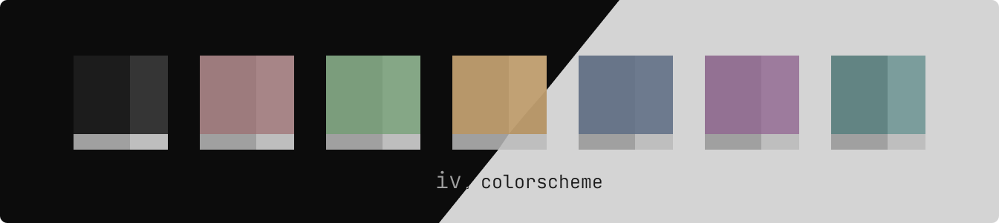
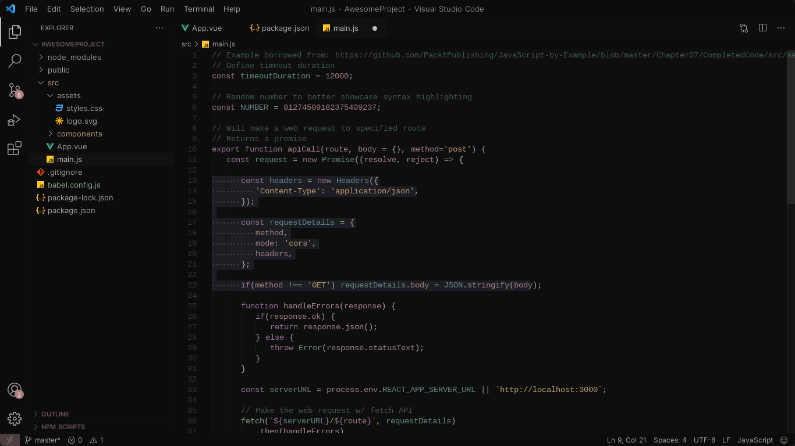
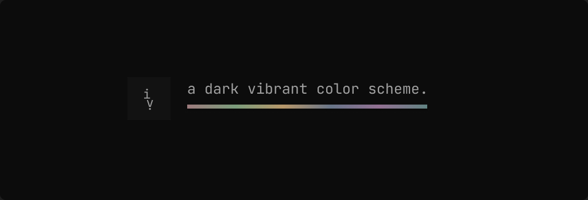

  
  <h1>iv : vscode.</h1>
  
A dark vibrant minimal colorscheme designed for vscode.

  <h6>
    <a href="#-about">About</a> ·
    <a href="#-acknowledgment">Acknowledgment</a>
  </h6>

  
  
    

  

  

  

## 📚 About
#### IV (noun) [ī-ˈvē]
##### For contributing kindly check the specific [docs here](contributing.md)

  
A dark vibrant color scheme intended to be pale attractive and elegant in the eyes of the user It intends to be high-contrast.   
Yet preserving a reasonable degree of low-contrast that emphasizes simplicity and readability of the theme.  

## 💝 Acknowledgment
#### With these wonderful software/people IV. is made possible (cttro)!

- [Coolors.co](https://coolors.co) - Great palette generation.
- [Htmlcolorcodes.com](https://htmlcolorcodes.com) - Website with clean UI for handling hex color codes or rgb (even hsl).
- [Figma.com](https://figma.com) - Interface design tool that I use to design mostly all assets. Worth checking out (it offers free plan)
